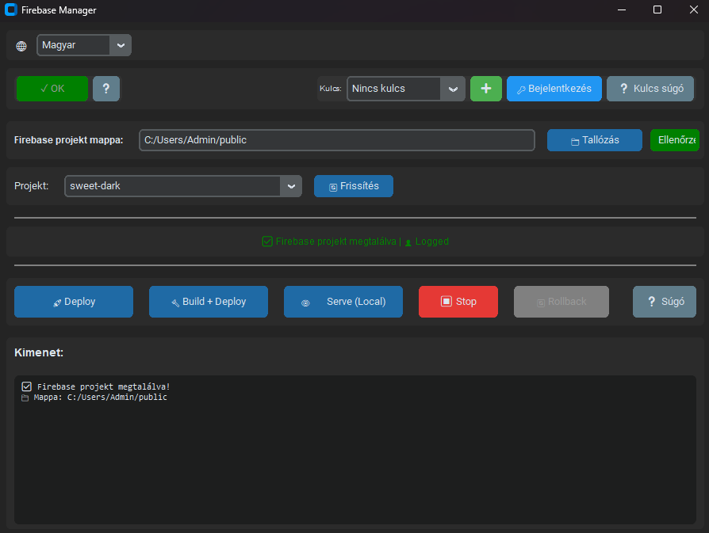

# 🔥 Firebase Manager

A modern desktop GUI application for managing Firebase projects with ease. Built with Python and CustomTkinter.

[🇭🇺 Magyar verzió](#magyar-verzió) | [🇬🇧 English version](#english-version)

---

## 🇬🇧 English Version

### 📋 Features

- 🔐 **Multiple Login Methods**
  - Browser-based login (traditional Firebase CLI)
  - Service Account JSON key authentication (no browser needed)
  
- 🚀 **Firebase Operations**
  - Deploy to Firebase Hosting
  - Build + Deploy (automatic npm build before deploy)
  - Local development server (firebase serve)
  - Process management (start/stop servers)
  
- 🔄 **Version Management**
  - Rollback to previous versions via REST API
  - View deployment history
  - One-click version restore
  
- 📁 **Project Management**
  - Easy project folder selection
  - Recent folders history
  - Multiple Firebase project support
  - Project switching
  
- 🌐 **Multi-language Support**
  - English
  - Hungarian (Magyar)
  - Language persists between sessions
  
- 🔑 **Key Management**
  - Store multiple Service Account keys
  - Quick key switching
  - Secure key storage in local `keys/` folder

### 🖼️ Screenshots


*Main interface with language selector*

### 📦 Installation

#### Prerequisites

- **Python 3.8+**
- **Node.js** (for Firebase CLI)
- **npm** (comes with Node.js)

#### Step 1: Clone the repository

```bash
git clone https://github.com/yourusername/firebase-manager.git
cd firebase-manager
```

#### Step 2: Install Python dependencies

```bash
pip install -r requirements.txt
```

#### Step 3: Install Firebase CLI

```bash
npm install -g firebase-tools
```

### 🚀 Usage

#### Starting the application

```bash
python firebase_manager.py
```

#### First-time setup

1. **Select Language**: Choose English or Magyar from the dropdown at the top
2. **Login**: Click "🔐 Login" for browser-based authentication
3. **Select Project Folder**: Browse to your Firebase project directory
4. **Check Project**: Click "✓ Check" to verify firebase.json exists
5. **Select Project**: Choose your Firebase project from the dropdown

#### Using Service Account Keys

For automated deployments or CI/CD:

1. Get a Service Account key from [Firebase Console](https://console.firebase.google.com)
   - Go to Project Settings → Service Accounts
   - Click "Generate new private key"
   
2. Click "➕" to add the key to the app
3. Select the key from the dropdown
4. Click "🔑 Login with Key"

⚠️ **Security Note**: Never commit Service Account keys to version control!

#### Operations

- **🚀 Deploy**: Upload your app to Firebase
- **🔨 Build + Deploy**: Run `npm run build` then deploy
- **👁️ Serve (Local)**: Start local development server
- **⏹️ Stop**: Stop running processes
- **🔄 Rollback**: Restore a previous version (requires JSON key)

### 🔧 Configuration

Settings are automatically saved in `app_config.json`:
- Last selected project folder
- Recent folders history
- Selected language
- Window size and position
- Last used Service Account key

### 🛠️ Development

#### Project Structure

```
firebase-manager/
├── firebase_manager.py    # Main application
├── translations.py         # Language translations
├── requirements.txt        # Python dependencies
├── keys/                   # Service Account keys (gitignored)
├── app_config.json        # User settings (gitignored)
└── README.md              # This file
```

#### Adding new translations

Edit `translations.py` and add your text to both `"en"` and `"hu"` dictionaries.

### 📝 License

MIT License - see [LICENSE](LICENSE) file for details

### 🤝 Contributing

Contributions are welcome! Please feel free to submit a Pull Request.

### 🐛 Issues

Found a bug? Please [open an issue](https://github.com/yourusername/firebase-manager/issues).

### 👨‍💻 Author

Created with ❤️ by Turbucz János

---

## 🇭🇺 Magyar Verzió

### 📋 Funkciók

- 🔐 **Többféle Bejelentkezési Mód**
  - Böngészős bejelentkezés (hagyományos Firebase CLI)
  - Service Account JSON kulcs hitelesítés (böngésző nélkül)
  
- 🚀 **Firebase Műveletek**
  - Deploy Firebase Hosting-ra
  - Build + Deploy (automatikus npm build deploy előtt)
  - Helyi fejlesztői szerver (firebase serve)
  - Folyamatkezelés (szerverek indítása/leállítása)
  
- 🔄 **Verziókezelés**
  - Visszaállás korábbi verziókra REST API-n keresztül
  - Deploy történet megtekintése
  - Egy kattintásos verzió visszaállítás
  
- 📁 **Projektkezelés**
  - Egyszerű projekt mappa választás
  - Legutóbbi mappák előzményei
  - Több Firebase projekt támogatás
  - Projekt váltás
  
- 🌐 **Többnyelvű Támogatás**
  - Angol (English)
  - Magyar
  - A nyelv megmarad munkamenetek között
  
- 🔑 **Kulcskezelés**
  - Több Service Account kulcs tárolása
  - Gyors kulcsváltás
  - Biztonságos kulcstárolás helyi `keys/` mappában

### 🖼️ Képernyőképek


*Főképernyő nyelvválasztóval*

### 📦 Telepítés

#### Előfeltételek

- **Python 3.8+**
- **Node.js** (Firebase CLI-hez)
- **npm** (Node.js-sel együtt jön)

#### 1. lépés: Repository klónozása

```bash
git clone https://github.com/yourusername/firebase-manager.git
cd firebase-manager
```

#### 2. lépés: Python függőségek telepítése

```bash
pip install -r requirements.txt
```

#### 3. lépés: Firebase CLI telepítése

```bash
npm install -g firebase-tools
```

### 🚀 Használat

#### Alkalmazás indítása

```bash
python firebase_manager.py
```

#### Első használat

1. **Nyelv választás**: Válassz English vagy Magyar nyelvet a felső legördülő menüből
2. **Bejelentkezés**: Kattints a "🔐 Login" gombra böngészős hitelesítéshez
3. **Projekt mappa választás**: Tallózd ki a Firebase projekt könyvtáradat
4. **Projekt ellenőrzés**: Kattints az "✓ Ellenőrzés" gombra, hogy ellenőrizd a firebase.json létezését
5. **Projekt választás**: Válaszd ki a Firebase projektedet a legördülő menüből

#### Service Account Kulcsok Használata

Automatizált deploy-okhoz vagy CI/CD-hez:

1. Szerezz be egy Service Account kulcsot a [Firebase Console-ból](https://console.firebase.google.com)
   - Menj a Project Settings → Service Accounts menüpontba
   - Kattints a "Generate new private key" gombra
   
2. Kattints a "➕" gombra a kulcs hozzáadásához
3. Válaszd ki a kulcsot a legördülő menüből
4. Kattints a "🔑 Bejelentkezés" gombra

⚠️ **Biztonsági Megjegyzés**: Soha ne commitálj Service Account kulcsokat verziókezelésbe!

#### Műveletek

- **🚀 Deploy**: Alkalmazás feltöltése Firebase-re
- **🔨 Build + Deploy**: `npm run build` futtatása, majd deploy
- **👁️ Serve (Local)**: Helyi fejlesztői szerver indítása
- **⏹️ Stop**: Futó folyamatok leállítása
- **🔄 Rollback**: Korábbi verzió visszaállítása (JSON kulcs szükséges)

### 🔧 Konfiguráció

A beállítások automatikusan mentődnek az `app_config.json` fájlba:
- Utoljára kiválasztott projekt mappa
- Legutóbbi mappák előzményei
- Kiválasztott nyelv
- Ablak mérete és pozíciója
- Utoljára használt Service Account kulcs

### 🛠️ Fejlesztés

#### Projekt Struktúra

```
firebase-manager/
├── firebase_manager.py    # Fő alkalmazás
├── translations.py         # Nyelvi fordítások
├── requirements.txt        # Python függőségek
├── keys/                   # Service Account kulcsok (gitignore-olva)
├── app_config.json        # Felhasználói beállítások (gitignore-olva)
└── README.md              # Ez a fájl
```

#### Új fordítások hozzáadása

Szerkeszd a `translations.py` fájlt és add hozzá a szöveget mind az `"en"`, mind a `"hu"` szótárhoz.

### 📝 Licensz

MIT Licensz - részletekért lásd a [LICENSE](LICENSE) fájlt

### 🤝 Közreműködés

A közreműködéseket szívesen fogadjuk! Nyugodtan nyiss Pull Request-et.

### 🐛 Hibák

Találtál hibát? Kérlek [nyiss egy issue-t](https://github.com/yourusername/firebase-manager/issues).

### 👨‍💻 Készítő

Készítette ❤️-tel Turbucz János

---

## 🌟 Star History

If you find this project useful, please consider giving it a star! ⭐

Ha hasznosnak találod ezt a projektet, kérlek adj neki egy csillagot! ⭐
